# Function Service Specification

## Overview
The Function Service is a gRPC-based service that provides a standardized interface for executing functions in a serverless environment. It handles function invocation, lifecycle management, and event processing using CloudEvents. The service uses NATS JetStream for internal communication and state management, with a plugin-based architecture for function execution.

## Architecture

### System Components
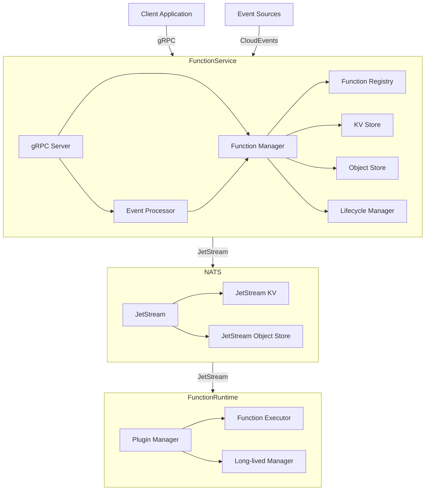

### Component Description
1. **Client Application**
   - External applications that invoke functions
   - Communicates via gRPC
   - Supports timeout-based execution
   - Handles CloudEvents conversion

2. **Function Service**
   - **gRPC Server**: 
     - Handles incoming RPC requests
     - Manages connection pooling
     - Implements request validation
   - **Event Processor**: 
     - Processes CloudEvents
     - Validates event schemas
     - Handles event routing
   - **Function Manager**: 
     - Manages function lifecycle
     - Handles function deployment
     - Manages function versions
   - **KV Store**:
     - Stores function configurations
     - Manages function metadata
     - Handles function updates
   - **Object Store**:
     - Stores function code
     - Manages function artifacts
     - Handles versioning
   - **Registry**:
     - Manages function plugins
     - Handles plugin lifecycle
     - Provides execution interface

3. **NATS Service**
   - **JetStream**:
     - Provides high-performance messaging
     - Handles message persistence
     - Manages message delivery guarantees
   - **KV Store**:
     - Stores function configurations
     - Manages function metadata
     - Supports watch operations
   - **Object Store**:
     - Stores function code
     - Manages function artifacts
     - Handles versioning

4. **Function Runtime**
   - **Plugin Manager**:
     - Manages function plugins
     - Handles plugin lifecycle
     - Provides isolation
   - **Function Executor**:
     - Executes function code
     - Manages execution context
     - Handles timeouts
   - **Long-lived Manager**:
     - Manages long-lived function instances
     - Handles function state persistence
     - Manages function lifecycle
     - Handles reconnection and recovery

## Long-lived Functions

### Overview
Long-lived functions are functions that maintain their state and continue running for extended periods. They are useful for:
- Continuous data processing
- Real-time event handling
- Stateful computations
- Background tasks
- WebSocket connections
- Stream processing

### Function Types

1. **Stateless Functions**
   - Traditional serverless functions
   - No state persistence
   - Short execution time
   - Event-driven execution

2. **Long-lived Functions**
   - Maintain state between executions
   - Can run continuously
   - Support background processing
   - Handle persistent connections
   - Support graceful shutdown and recovery

### Long-lived Function Lifecycle
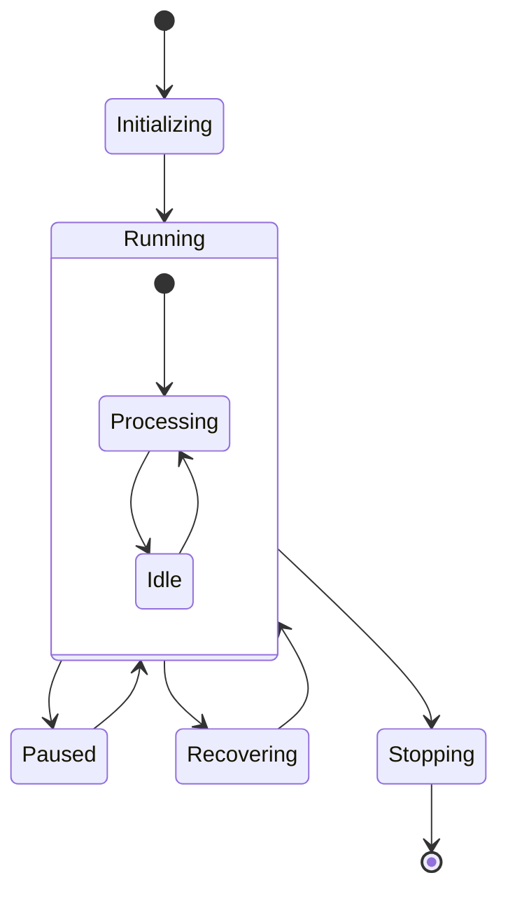

### State Management
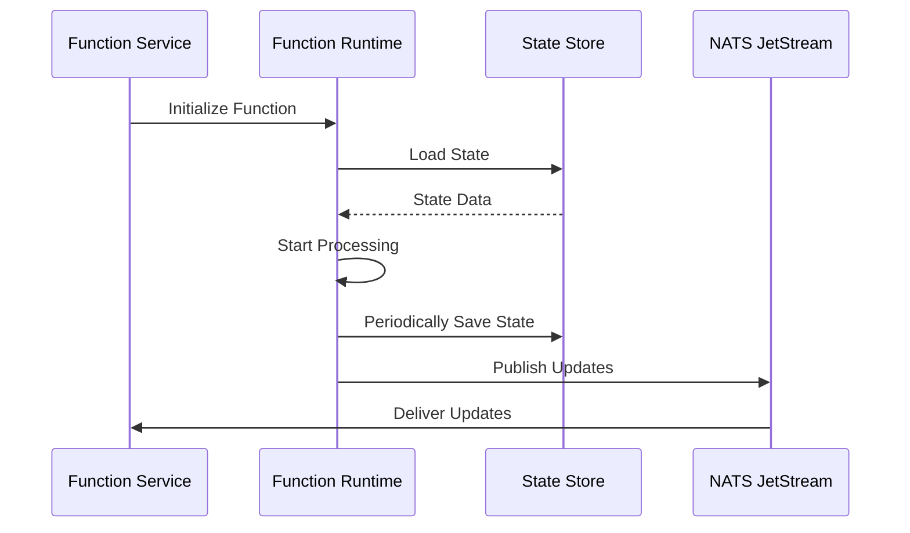

### Implementation Details

#### Function Interface
```go
type LongLivedFunction interface {
    // Initialize is called when the function starts
    Initialize(ctx context.Context) error
    
    // Process handles the main function logic
    Process(ctx context.Context, event *event.Event) error
    
    // Pause temporarily stops processing
    Pause(ctx context.Context) error
    
    // Resume continues processing
    Resume(ctx context.Context) error
    
    // Stop gracefully shuts down the function
    Stop(ctx context.Context) error
    
    // GetState returns the current function state
    GetState() ([]byte, error)
    
    // SetState restores function state
    SetState(state []byte) error
}
```

#### State Management
```go
type StateManager struct {
    // State store for persistence
    store jetstream.KeyValue
    
    // State cache for performance
    cache *cache.Cache
    
    // State sync for consistency
    sync *StateSync
}
```

#### Lifecycle Management
```go
type LifecycleManager struct {
    // Function instances
    instances map[string]*FunctionInstance
    
    // State manager
    state *StateManager
    
    // Health checker
    health *HealthChecker
}
```

### Configuration

1. **Function Configuration**
   ```yaml
   function:
     type: long-lived
     state:
       persistence: true
       sync: true
     lifecycle:
       autoRecover: true
       maxRetries: 3
     resources:
       memory: 512Mi
       cpu: 0.5
   ```

2. **Runtime Configuration**
   ```yaml
   runtime:
     longLived:
       stateSyncInterval: 30s
       healthCheckInterval: 10s
       maxConcurrent: 100
       recoveryTimeout: 5m
   ```

### Error Handling

1. **Recovery Scenarios**
   - Process crashes
   - Network disconnections
   - Resource exhaustion
   - State corruption

2. **Recovery Strategies**
   - State restoration
   - Process restart
   - Connection reestablishment
   - Resource reallocation

### Monitoring

1. **Long-lived Function Metrics**
   - Uptime
   - State size
   - Processing rate
   - Error rate
   - Resource usage
   - Recovery attempts

2. **Health Checks**
   - Process health
   - State consistency
   - Resource availability
   - Connection status

## Workflows

### Function Execution Flow
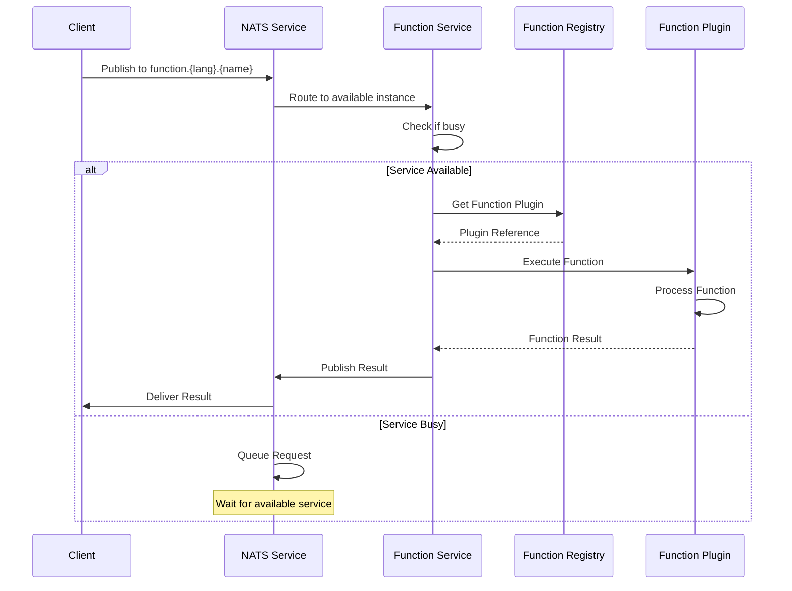

### NATS Subject Structure
```
function.{language}.{function_name}
Examples:
- function.go.process_data
- function.python.transform
- function.js.validate
```

### Function Service Instance Management
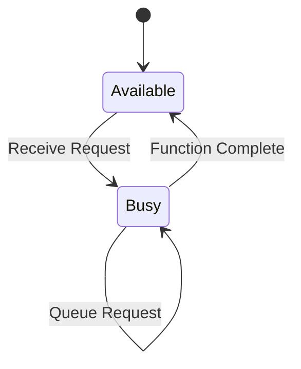

### Request Queuing
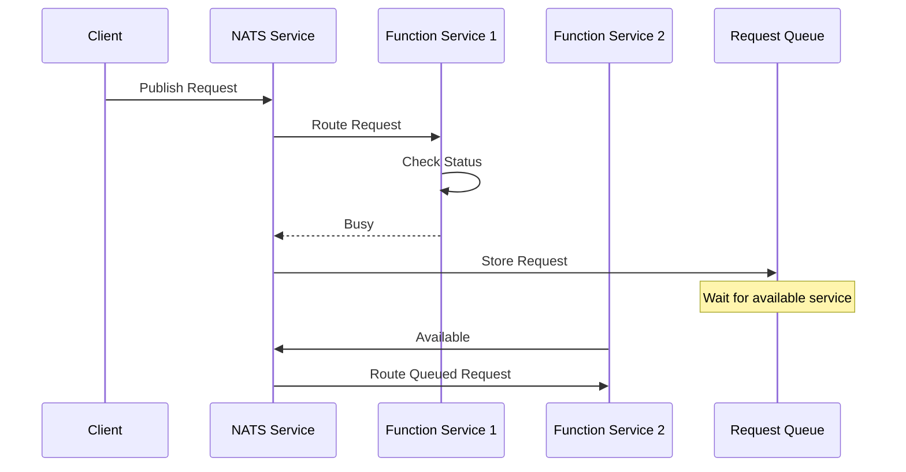

### Function Interface
```go
// Function represents a serverless function
type Function interface {
    // Execute processes the given event and returns a result
    Execute(ctx context.Context, event *event.Event) (*event.Event, error)
}

// FunctionResult represents the result of a function execution
type FunctionResult struct {
    Event *event.Event
    Error error
}
```

### NATS Configuration
```yaml
nats:
  subjects:
    function: "function.{language}.{name}"
    result: "function.result.{request_id}"
  queue:
    group: "function-service"
    maxPending: 1000
    maxAge: "1h"
  jetstream:
    stream: "functions"
    replicas: 3
    retention: "workqueue"
```

### Service Instance Management
```go
type ServiceInstance struct {
    // Current status
    status ServiceStatus
    
    // Current function being executed
    currentFunction string
    
    // Start time of current execution
    startTime time.Time
    
    // Mutex for status updates
    mu sync.RWMutex
}

type ServiceStatus int

const (
    StatusAvailable ServiceStatus = iota
    StatusBusy
    StatusShuttingDown
)
```

### Request Handling
```go
type RequestHandler struct {
    // NATS connection
    nc *nats.Conn
    
    // JetStream context
    js jetstream.JetStream
    
    // Service instance
    instance *ServiceInstance
    
    // Request queue
    queue jetstream.Consumer
}

func (h *RequestHandler) HandleRequest(msg *nats.Msg) {
    h.instance.mu.Lock()
    if h.instance.status == StatusBusy {
        // Queue the request
        h.queue.Next()
        h.instance.mu.Unlock()
        return
    }
    
    h.instance.status = StatusBusy
    h.instance.mu.Unlock()
    
    // Process the request
    // ...
    
    h.instance.mu.Lock()
    h.instance.status = StatusAvailable
    h.instance.mu.Unlock()
}
```

### Function Service Configuration
```yaml
service:
  instances:
    min: 2
    max: 10
  routing:
    strategy: "round-robin"
    languageBased: true
  queue:
    maxSize: 1000
    timeout: "5m"
  execution:
    timeout: "30s"
    maxRetries: 3
```

### Function Registration Flow
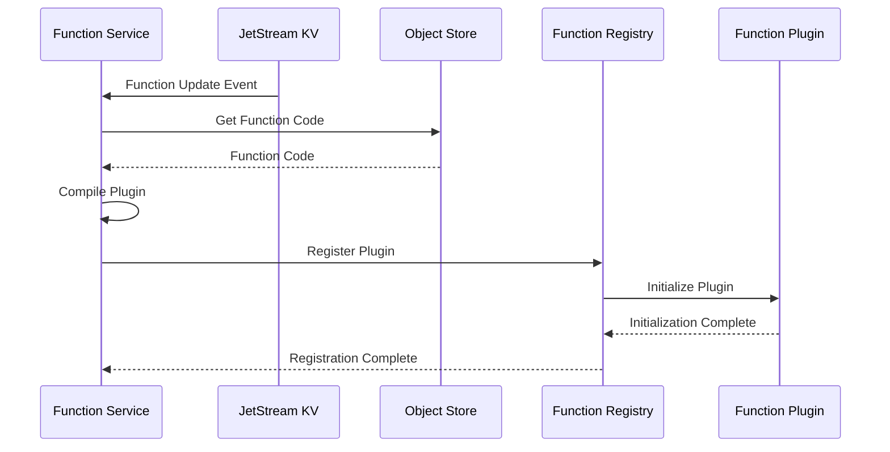

### Event Processing Flow
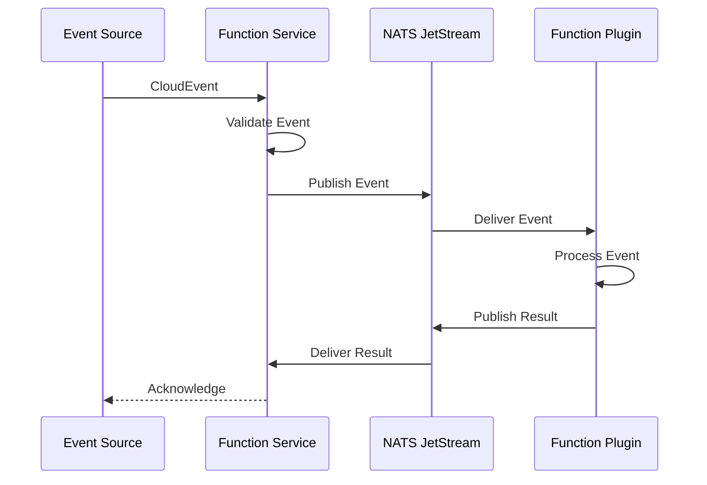

### Plugin Lifecycle Flow
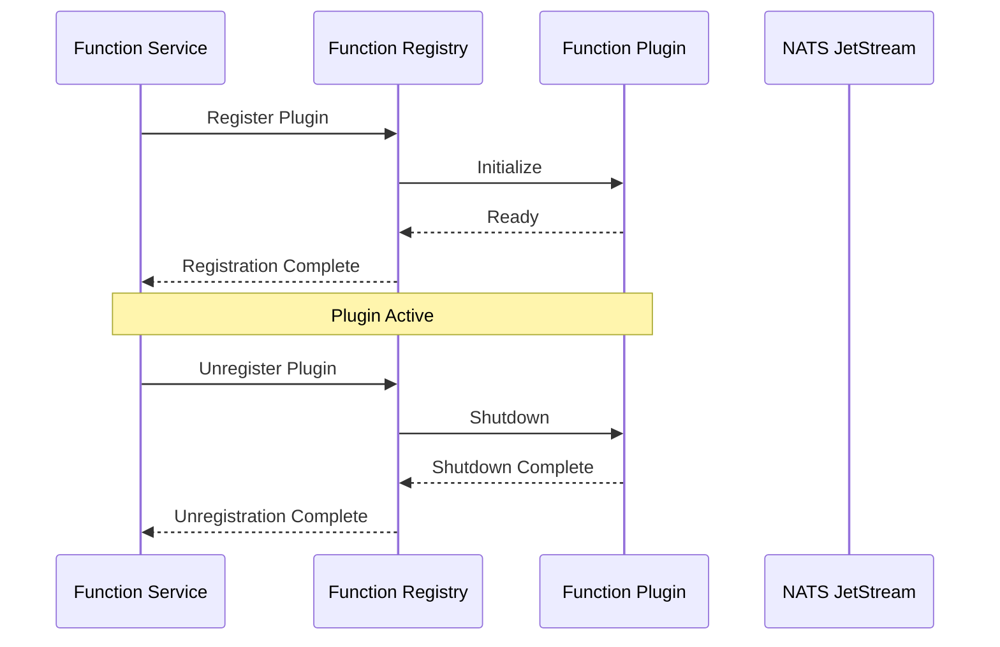

### Error Handling Flow
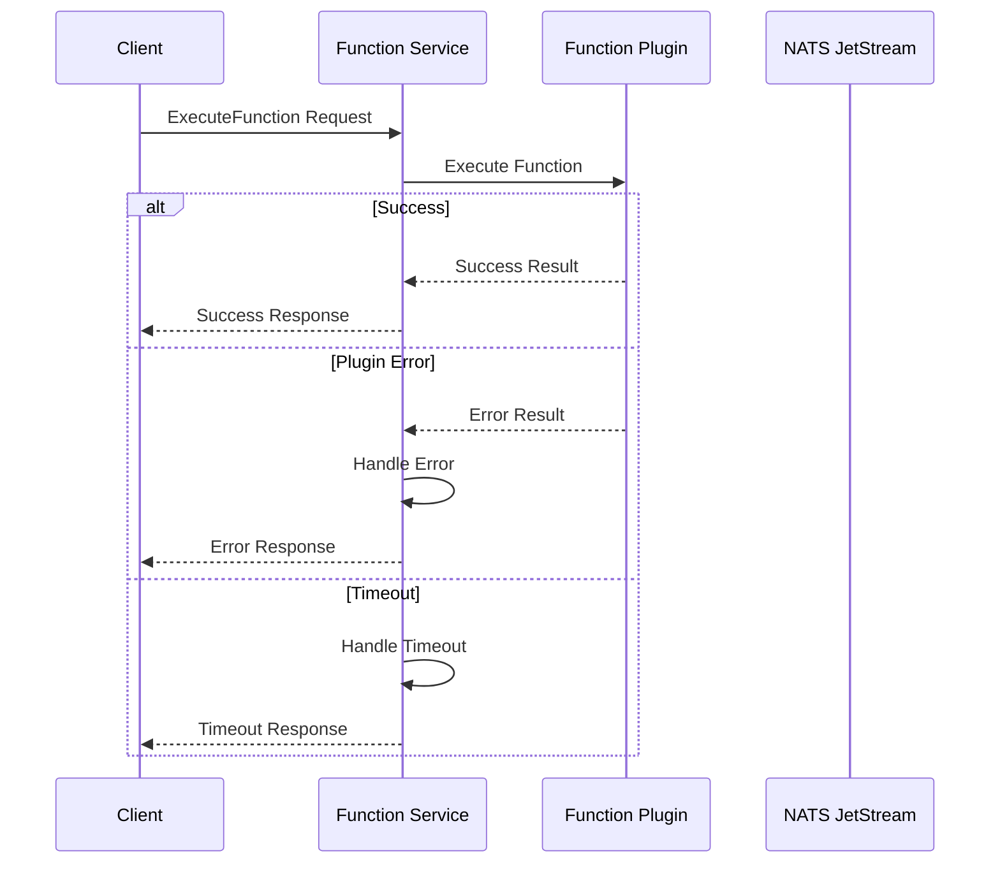

### Monitoring Flow
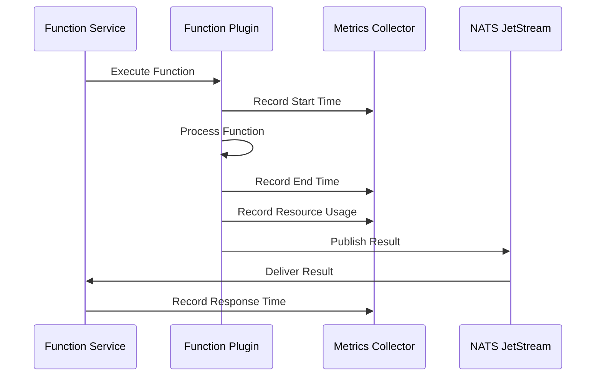

## Monitoring and Observability

### Metrics Collection
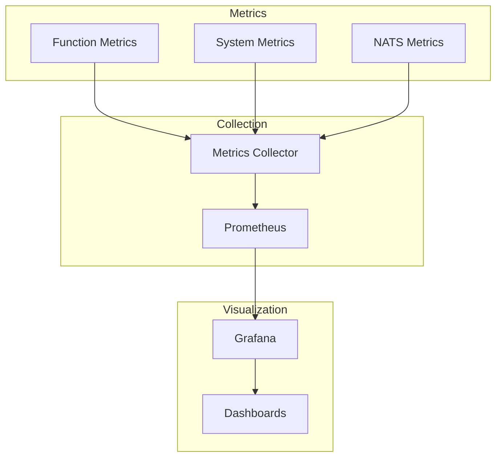

### Key Metrics

1. **Function Execution Metrics**
   - Execution time
   - Success/failure rate
   - Error types and counts
   - Memory usage
   - CPU usage

2. **System Metrics**
   - Active functions
   - Plugin health
   - Resource utilization
   - Queue lengths
   - Cache hit rates

3. **NATS Metrics**
   - Message throughput
   - Latency
   - Queue depths
   - Storage usage
   - Connection status

### Logging

1. **Function Logs**
   - Execution logs
   - Error logs
   - Performance logs
   - Resource usage logs

2. **System Logs**
   - Service logs
   - Plugin logs
   - Configuration logs
   - Health check logs

3. **NATS Logs**
   - Connection logs
   - Message logs
   - Storage logs
   - Error logs

### Alerting

1. **Function Alerts**
   - Execution failures
   - Timeout violations
   - Resource exhaustion
   - Error rate thresholds

2. **System Alerts**
   - Service health
   - Plugin failures
   - Resource constraints
   - Configuration issues

3. **NATS Alerts**
   - Connection issues
   - Storage capacity
   - Message backlog
   - Performance degradation

## Implementation Details

### Function Service
```go
type Service struct {
    js       jetstream.JetStream
    kv       jetstream.KeyValue
    store    jetstream.ObjectStore
    registry *Registry
    server   *grpc.Server
}
```

### Client
```go
type Client struct {
    conn   *grpc.ClientConn
    client pb.FunctionServiceClient
}
```

### Registry
```go
type Registry struct {
    mu        sync.RWMutex
    plugins   map[string]*plugin.Client
    functions map[string]Function
}
```

## API Definition

### Service Interface
```protobuf
service FunctionService {
  // ExecuteFunction executes a function with the given request
  rpc ExecuteFunction(ExecuteFunctionRequest) returns (ExecuteFunctionResponse) {}
}
```

### Message Types

#### ExecuteFunctionRequest
```protobuf
message ExecuteFunctionRequest {
  // Function name
  string name = 1;
  
  // CloudEvent for function execution
  CloudEvent event = 2;
}
```

#### ExecuteFunctionResponse
```protobuf
message ExecuteFunctionResponse {
  oneof result {
    bytes data = 1;
    string error = 2;
  }
}
```

## Future Considerations
1. Enhanced monitoring and observability
2. Advanced scaling capabilities
3. Extended event processing features
4. Improved resource management
5. Enhanced security features

### NATS Routing and Queuing

#### Subject Structure and Routing
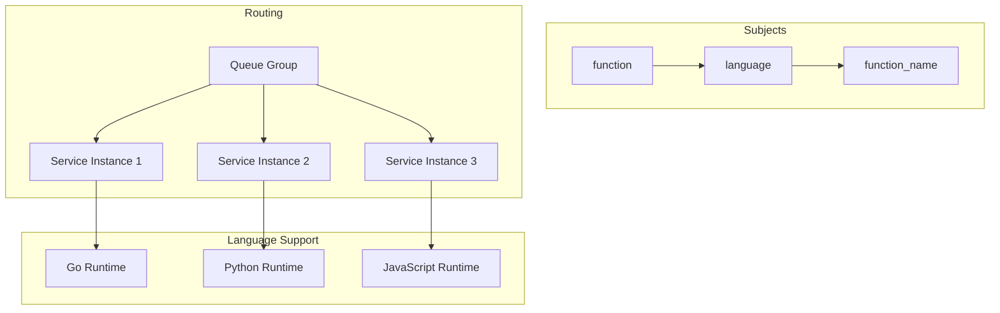

#### Subject Patterns
```
1. Function Invocation:
   function.{language}.{function_name}
   Example: function.go.process_data

2. Function Results:
   function.result.{request_id}
   Example: function.result.123e4567

3. Service Status:
   function.status.{instance_id}
   Example: function.status.svc-1

4. Health Checks:
   function.health.{instance_id}
   Example: function.health.svc-1
```

#### Queue Groups
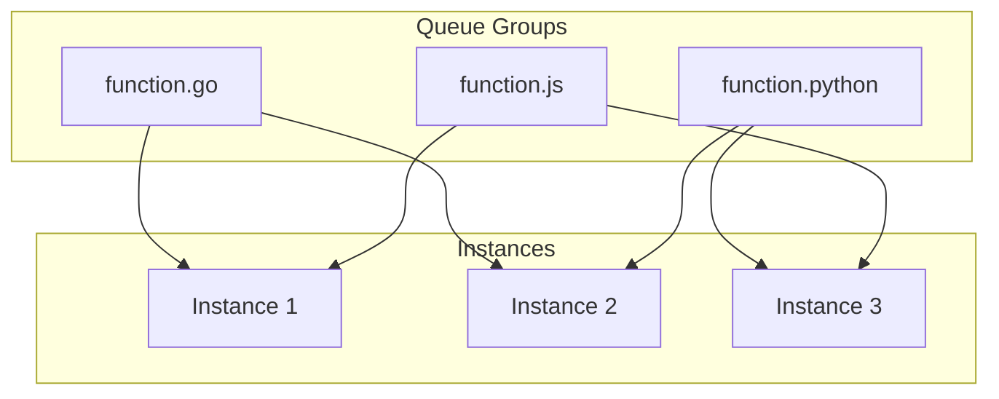

#### Request Flow
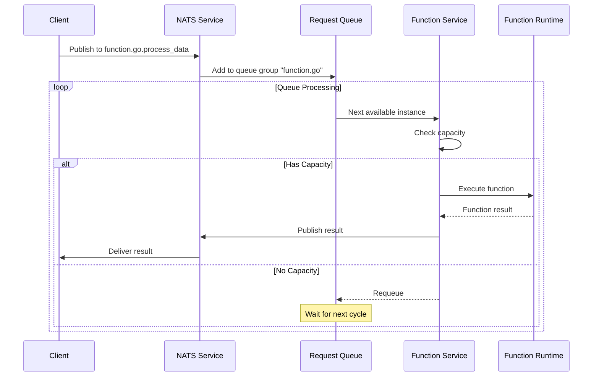

### Queue Management

#### Queue Configuration
```yaml
queue:
  groups:
    - name: "function.go"
      maxPending: 1000
      maxAge: "1h"
      maxDeliver: 3
      ackWait: "30s"
    - name: "function.python"
      maxPending: 1000
      maxAge: "1h"
      maxDeliver: 3
      ackWait: "30s"
    - name: "function.js"
      maxPending: 1000
      maxAge: "1h"
      maxDeliver: 3
      ackWait: "30s"
  settings:
    maxSize: 10000
    maxAge: "24h"
    storage: "memory"
    replicas: 3
```

#### Queue Implementation
```go
type QueueManager struct {
    // NATS connection
    nc *nats.Conn
    
    // JetStream context
    js jetstream.JetStream
    
    // Queue groups by language
    queues map[string]jetstream.Consumer
    
    // Queue configuration
    config QueueConfig
    
    // Queue metrics
    metrics *QueueMetrics
}

type QueueConfig struct {
    // Maximum number of pending messages
    MaxPending int
    
    // Maximum age of messages
    MaxAge time.Duration
    
    // Maximum number of delivery attempts
    MaxDeliver int
    
    // Acknowledgment wait time
    AckWait time.Duration
}

type QueueMetrics struct {
    // Current queue size
    Size int64
    
    // Number of pending messages
    Pending int64
    
    // Number of redelivered messages
    Redelivered int64
    
    // Average processing time
    AvgProcessingTime time.Duration
}
```

#### Queue Processing
```go
type QueueProcessor struct {
    // Queue manager
    manager *QueueManager
    
    // Service instances
    instances map[string]*ServiceInstance
    
    // Processing workers
    workers []*Worker
    
    // Processing configuration
    config ProcessingConfig
}

type ProcessingConfig struct {
    // Number of workers
    WorkerCount int
    
    // Batch size for processing
    BatchSize int
    
    // Processing timeout
    Timeout time.Duration
    
    // Retry configuration
    RetryConfig RetryConfig
}

type RetryConfig struct {
    // Maximum number of retries
    MaxRetries int
    
    // Retry backoff
    Backoff time.Duration
    
    // Maximum backoff
    MaxBackoff time.Duration
}
```

#### Queue Monitoring
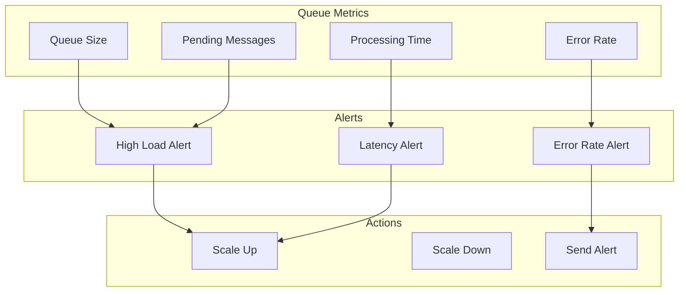

#### Queue Health Checks
```go
type QueueHealth struct {
    // Queue status
    Status string
    
    // Last processed message
    LastProcessed time.Time
    
    // Error count
    ErrorCount int64
    
    // Processing rate
    ProcessingRate float64
    
    // Queue depth
    QueueDepth int64
}

func (q *QueueManager) HealthCheck() *QueueHealth {
    return &QueueHealth{
        Status:          q.getStatus(),
        LastProcessed:   q.getLastProcessed(),
        ErrorCount:      q.getErrorCount(),
        ProcessingRate:  q.getProcessingRate(),
        QueueDepth:      q.getQueueDepth(),
    }
}
``` 