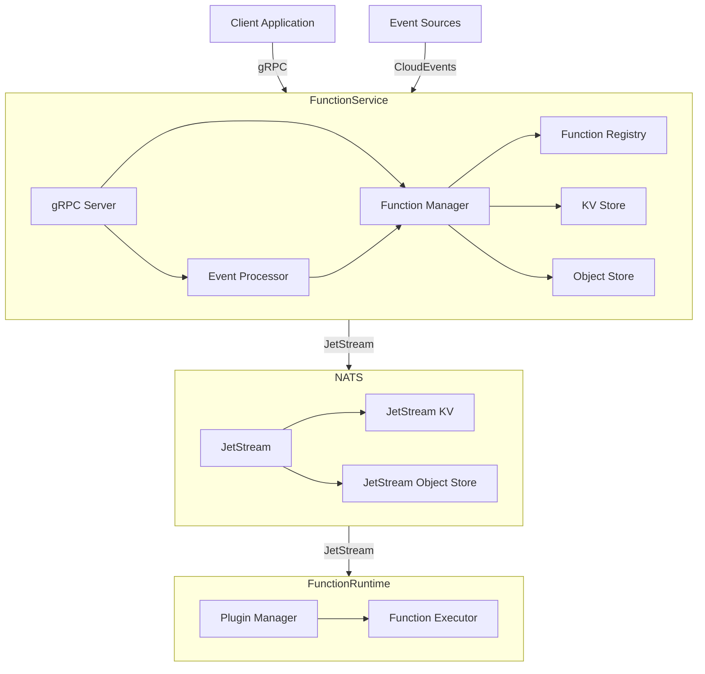
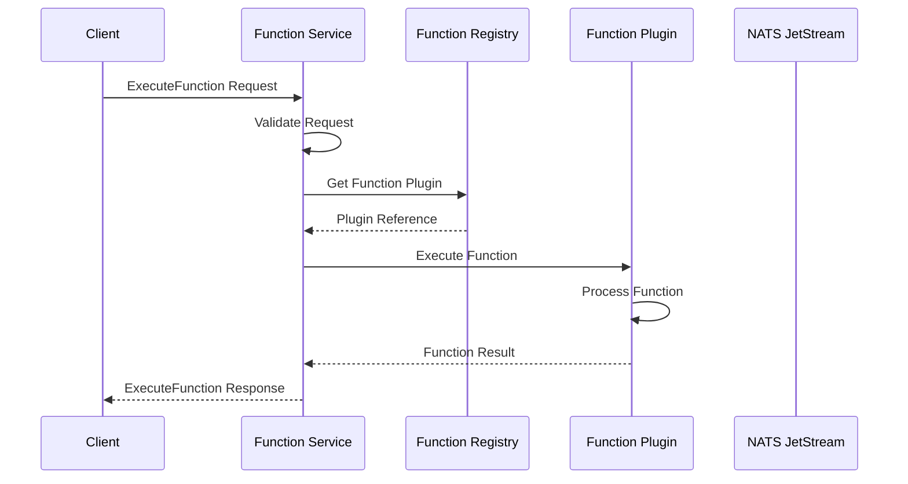
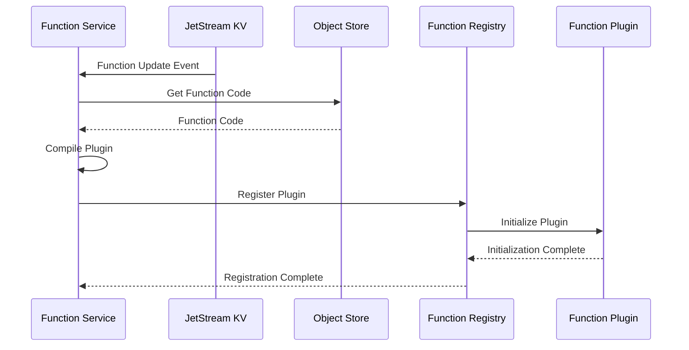
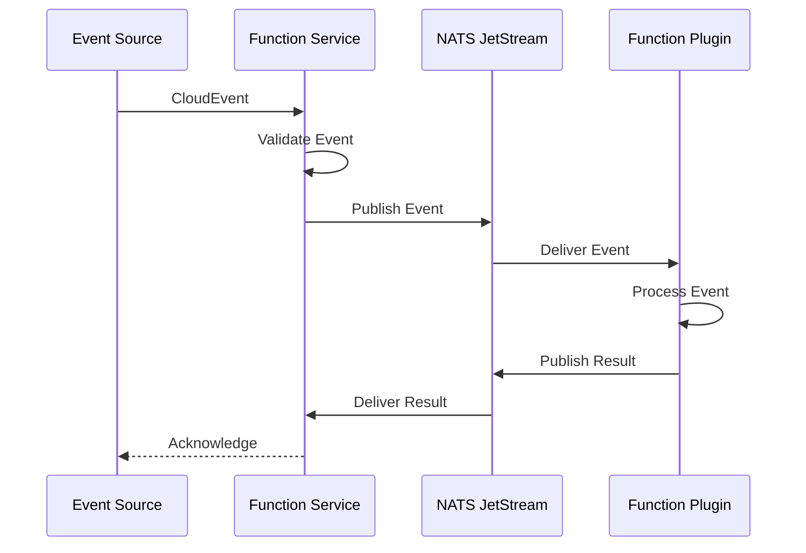
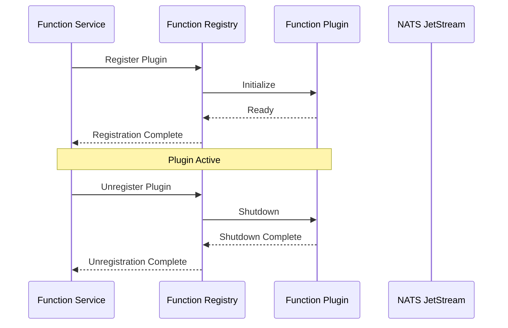
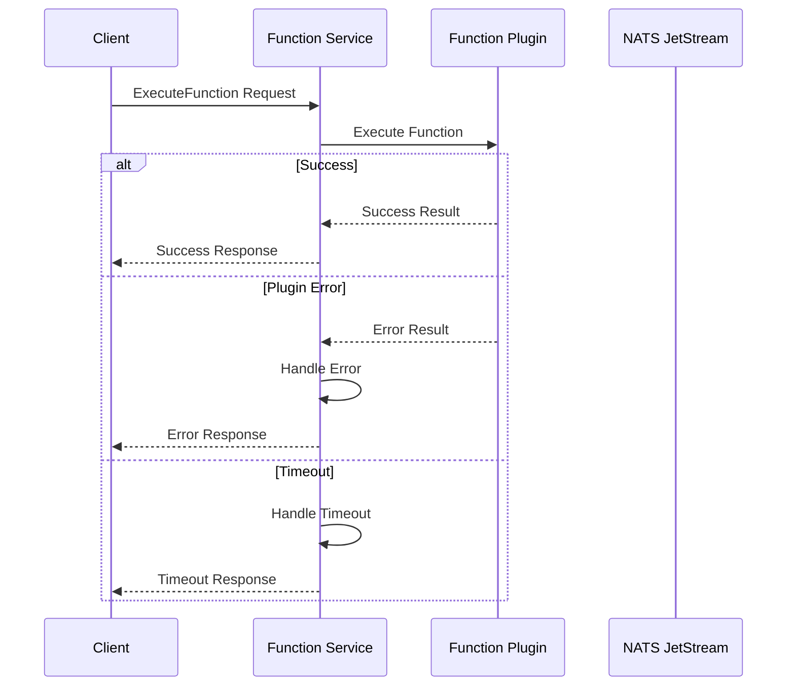
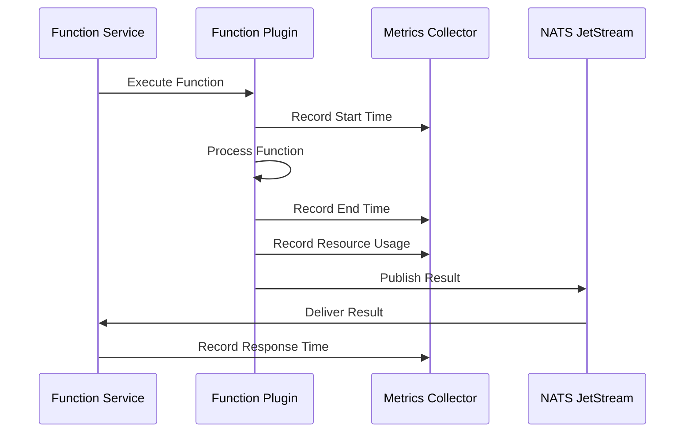
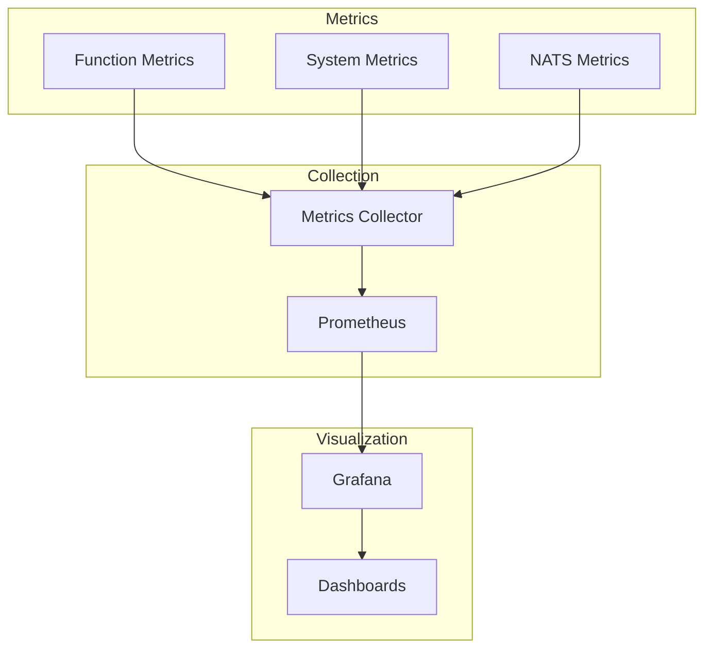

# Function Service Specification

## Overview
The Function Service is a gRPC-based service that provides a standardized interface for executing functions in a serverless environment. It handles function invocation, lifecycle management, and event processing using CloudEvents. The service uses NATS JetStream for internal communication and state management, with a plugin-based architecture for function execution.

## Architecture

### System Components


### Component Description
1. **Client Application**
   - External applications that invoke functions
   - Communicates via gRPC
   - Supports timeout-based execution
   - Handles CloudEvents conversion

2. **Function Service**
   - **gRPC Server**: 
     - Handles incoming RPC requests
     - Manages connection pooling
     - Implements request validation
   - **Event Processor**: 
     - Processes CloudEvents
     - Validates event schemas
     - Handles event routing
   - **Function Manager**: 
     - Manages function lifecycle
     - Handles function deployment
     - Manages function versions
   - **KV Store**:
     - Stores function configurations
     - Manages function metadata
     - Handles function updates
   - **Object Store**:
     - Stores function code
     - Manages function artifacts
     - Handles versioning
   - **Registry**:
     - Manages function plugins
     - Handles plugin lifecycle
     - Provides execution interface

3. **NATS Service**
   - **JetStream**:
     - Provides high-performance messaging
     - Handles message persistence
     - Manages message delivery guarantees
   - **KV Store**:
     - Stores function configurations
     - Manages function metadata
     - Supports watch operations
   - **Object Store**:
     - Stores function code
     - Manages function artifacts
     - Handles versioning

4. **Function Runtime**
   - **Plugin Manager**:
     - Manages function plugins
     - Handles plugin lifecycle
     - Provides isolation
   - **Function Executor**:
     - Executes function code
     - Manages execution context
     - Handles timeouts

## Workflows

### Function Execution Flow


### Function Registration Flow


### Event Processing Flow


### Plugin Lifecycle Flow


### Error Handling Flow


### Monitoring Flow


## Monitoring and Observability

### Metrics Collection


### Key Metrics

1. **Function Execution Metrics**
   - Execution time
   - Success/failure rate
   - Error types and counts
   - Memory usage
   - CPU usage

2. **System Metrics**
   - Active functions
   - Plugin health
   - Resource utilization
   - Queue lengths
   - Cache hit rates

3. **NATS Metrics**
   - Message throughput
   - Latency
   - Queue depths
   - Storage usage
   - Connection status

### Logging

1. **Function Logs**
   - Execution logs
   - Error logs
   - Performance logs
   - Resource usage logs

2. **System Logs**
   - Service logs
   - Plugin logs
   - Configuration logs
   - Health check logs

3. **NATS Logs**
   - Connection logs
   - Message logs
   - Storage logs
   - Error logs

### Alerting

1. **Function Alerts**
   - Execution failures
   - Timeout violations
   - Resource exhaustion
   - Error rate thresholds

2. **System Alerts**
   - Service health
   - Plugin failures
   - Resource constraints
   - Configuration issues

3. **NATS Alerts**
   - Connection issues
   - Storage capacity
   - Message backlog
   - Performance degradation

## Implementation Details

### Function Service
```go
type Service struct {
    js       jetstream.JetStream
    kv       jetstream.KeyValue
    store    jetstream.ObjectStore
    registry *Registry
    server   *grpc.Server
}
```

### Client
```go
type Client struct {
    conn   *grpc.ClientConn
    client pb.FunctionServiceClient
}
```

### Registry
```go
type Registry struct {
    mu        sync.RWMutex
    plugins   map[string]*plugin.Client
    functions map[string]Function
}
```

## API Definition

### Service Interface
```protobuf
service FunctionService {
  // ExecuteFunction executes a function with the given request
  rpc ExecuteFunction(ExecuteFunctionRequest) returns (ExecuteFunctionResponse) {}
}
```

### Message Types

#### ExecuteFunctionRequest
```protobuf
message ExecuteFunctionRequest {
  // Function name
  string name = 1;
  
  // CloudEvent for function execution
  CloudEvent event = 2;
}
```

#### ExecuteFunctionResponse
```protobuf
message ExecuteFunctionResponse {
  oneof result {
    bytes data = 1;
    string error = 2;
  }
}
```

## Future Considerations
1. Enhanced monitoring and observability
2. Advanced scaling capabilities
3. Extended event processing features
4. Improved resource management
5. Enhanced security features 