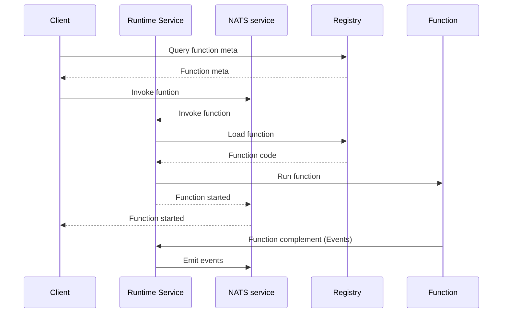

[NATS service API](https://docs.nats.io/using-nats/developer/services)

# Component of Function 

## Client
Client call "invokeFunction(Function, Event)" though NAT service API. First it retrieve function information from registry. The function should contain at least name and type. Type is what kind of runtime it should use (for example, golang, nats)

### Client Responsibilities
- Function discovery and metadata retrieval
- Event payload construction and validation
- Response handling and event processing
- Error handling and retry logic
- Authentication and authorization

## Runtime Service
Service is a NATS service that recevice call from client. It load actual function call (binary from Object store, use hasicorp go-plugin with grpc) and run

### Runtime Service Responsibilities
- Function lifecycle management
- Resource allocation and isolation
- Plugin loading and management
- Event routing and processing
- Health monitoring and metrics collection
- Graceful shutdown and cleanup

### NATS Integration Details
- **Service Discovery**
  - Uses NATS service discovery for runtime service registration
  - Implements health checks and heartbeat monitoring
  - Supports service metadata and versioning

- **Message Patterns**
  - Request-Reply for synchronous function calls
  - Publish-Subscribe for event broadcasting
  - Queue Groups for load balancing
  - JetStream for persistent messaging

- **NATS Configuration**
  ```go
  type NATSConfig struct {
      URL            string
      Credentials    string
      MaxReconnects  int
      ReconnectWait  time.Duration
      QueueGroup     string
      JetStream      bool
      StreamConfig   *nats.StreamConfig
  }
  ```

### Plugin System
The runtime supports two plugin mechanisms:

1. **Native Go Plugin**
   - Direct loading of Go plugins using `plugin.Open()`
   - Supports hot-reloading of functions
   - Limited to same OS/architecture
   ```go
   type NativePlugin struct {
       Path     string
       Symbol   string
       Function interface{}
   }
   ```

2. **HashiCorp Go Plugin with gRPC**
   - Cross-platform support
   - Process isolation
   - Protocol versioning
   - Secure communication
   ```go
   type HashiCorpPlugin struct {
       Path       string
       Protocol   int
       Version    string
       GRPCConfig *grpc.Config
   }
   ```

#### Plugin Interface
```go
// Base interface for all plugins
type Plugin interface {
    // Common plugin methods
    Name() string
    Version() string
    Type() string
}

// Function plugin interface
type FunctionPlugin interface {
    Plugin
    Execute(ctx context.Context, event *cloudevents.Event) ([]*cloudevents.Event, error)
}

// Plugin manager interface
type PluginManager interface {
    LoadPlugin(path string, pluginType string) (Plugin, error)
    UnloadPlugin(name string) error
    ListPlugins() []Plugin
    GetPlugin(name string) (Plugin, error)
}
```

#### Plugin Lifecycle
1. **Loading**
   - Plugin binary validation
   - Version compatibility check
   - Resource allocation
   - Initialization

2. **Runtime**
   - Process isolation
   - Resource monitoring
   - Error handling
   - Communication management

3. **Unloading**
   - Graceful shutdown
   - Resource cleanup
   - State persistence
   - Connection termination

#### Plugin Security
- Process isolation
- Resource limits
- Network access control
- File system restrictions
- Memory limits

## Registry
Store function meta in NATS KV. Store function execuable in object store (NATS or S3 is ok)

### Registry Components
- Function Metadata Store (NATS KV)
  - Function name and version
  - Runtime type and configuration
  - Resource requirements
  - Dependencies and environment variables
  - Access control and permissions
- Function Binary Store (Object Store)
  - Versioned function binaries
  - Plugin configurations
  - Resource files and assets

## Function
For golang implementation, its should be a goplugin implemented with hashicorp goplugin with GPRC. It accepts Event object (Cloudevents) as the input and return zero or one events(Other runtime:TBD)

### Function Interface
```go
type Function interface {
    // Execute processes the incoming event and returns zero or more events
    Execute(ctx context.Context, event *cloudevents.Event) ([]*cloudevents.Event, error)
    
    // Initialize is called when the function is loaded
    Initialize(ctx context.Context, config map[string]interface{}) error
    
    // Shutdown is called when the function is being unloaded
    Shutdown(ctx context.Context) error
}
```

### Function Requirements
- Must implement the Function interface
- Should handle context cancellation
- Must be thread-safe
- Should implement proper error handling
- Should include logging and metrics

# Flow



# Additional Considerations

## Security
- Function isolation and sandboxing
- Authentication and authorization
- Secure communication channels
- Resource limits and quotas

## Monitoring and Observability
- Function execution metrics
- Resource utilization
- Error tracking and logging
- Performance monitoring

### Metrics Collection
```go
type MetricsCollector interface {
    // Function execution metrics
    RecordFunctionInvocation(functionName string, duration time.Duration, status string)
    RecordFunctionError(functionName string, errorType string)
    RecordFunctionMemoryUsage(functionName string, memoryBytes int64)
    
    // Runtime service metrics
    RecordRuntimeServiceStatus(status string)
    RecordPluginLoadTime(pluginName string, duration time.Duration)
    RecordNATSMessagesSent(count int64)
    RecordNATSMessagesReceived(count int64)
}
```

### Prometheus Integration
- Custom metrics endpoints
- Standard Go metrics
- Runtime service metrics
- NATS metrics
- Plugin metrics

### Distributed Tracing
```go
type TracingConfig struct {
    ServiceName    string
    Endpoint       string
    SamplingRate   float64
    ExportTimeout  time.Duration
    BatchSize      int
}

type TraceSpan interface {
    // Create child span
    CreateChildSpan(name string) TraceSpan
    // Add attributes to span
    SetAttribute(key string, value interface{})
    // Record error
    RecordError(err error)
    // End span
    End()
}
```

#### Tracing Integration Points
1. **Function Execution**
   - Function invocation span
   - Plugin loading span
   - Event processing span
   - Error handling span

2. **NATS Communication**
   - Message publishing span
   - Message subscription span
   - Queue group operations span

3. **Plugin Operations**
   - Plugin loading span
   - Plugin initialization span
   - Plugin execution span
   - Plugin cleanup span

### Logging
```go
type LogConfig struct {
    Level      string
    Format     string
    Output     string
    MaxSize    int
    MaxBackups int
    MaxAge     int
}

type Logger interface {
    // Standard logging methods
    Debug(msg string, fields ...Field)
    Info(msg string, fields ...Field)
    Warn(msg string, fields ...Field)
    Error(msg string, fields ...Field)
    
    // Structured logging
    WithFields(fields ...Field) Logger
    WithTraceID(traceID string) Logger
    WithFunctionName(name string) Logger
}
```

### Health Checks
```go
type HealthCheck interface {
    // Runtime service health
    CheckRuntimeService() error
    // Plugin health
    CheckPlugin(name string) error
    // NATS connection health
    CheckNATSConnection() error
    // Registry health
    CheckRegistry() error
}
```

### Alerting
- Function error rate thresholds
- Resource utilization alerts
- Plugin health alerts
- NATS connection alerts
- Performance degradation alerts

### Dashboard Integration
- Grafana dashboards
- Custom metrics visualization
- Trace visualization
- Log aggregation
- Alert management

## Scalability
- Horizontal scaling of runtime services
- Load balancing
- Resource optimization
- Caching strategies

## Error Handling
- Retry mechanisms
- Circuit breakers
- Error propagation
- Dead letter queues

## Deployment
- Function versioning
- Rolling updates
- Blue-green deployments
- Configuration management

## Plugin Development Guidelines
- Plugin packaging and distribution
- Version management
- Testing and validation
- Documentation requirements
- Security best practices

## NATS Best Practices
- Connection management
- Error handling
- Message size limits
- Backpressure handling
- Monitoring and metrics

# MVP Implementation

## Phase 1: Core Components

### 1. Basic Runtime Service
```go
type RuntimeService struct {
    natsConn    *nats.Conn
    registry    Registry
    plugins     map[string]Plugin
    metrics     *BasicMetrics
}

func (rs *RuntimeService) Start() error {
    // Initialize NATS connection
    // Start function handler
    // Register service
}
```

#### Essential Features
- NATS connection management
- Basic function invocation
- Simple plugin loading (HashiCorp go-plugin only)
- Basic error handling

### 2. Minimal Registry
```go
type Registry struct {
    kv          nats.KeyValue
    objectStore ObjectStore
}

func (r *Registry) StoreFunction(meta FunctionMeta, binary []byte) error
func (r *Registry) GetFunction(name string) (FunctionMeta, []byte, error)
```

#### Essential Features
- Function metadata storage in NATS KV
- Binary storage in NATS Object Store
- Basic CRUD operations

### 3. Basic Function Interface
```go
type Function interface {
    Execute(ctx context.Context, event *cloudevents.Event) ([]*cloudevents.Event, error)
}
```

#### Essential Features
- Single event input/output
- Basic error handling
- Context support

### 4. Simple Client
```go
type Client struct {
    natsConn *nats.Conn
    registry Registry
}

func (c *Client) InvokeFunction(name string, event *cloudevents.Event) (*cloudevents.Event, error)
```

#### Essential Features
- Function discovery
- Event sending
- Basic response handling

## Phase 2: Basic Monitoring

### 1. Essential Metrics
```go
type BasicMetrics struct {
    functionInvocations    *prometheus.Counter
    functionErrors        *prometheus.Counter
    functionDuration      *prometheus.Histogram
}
```

#### Essential Features
- Function invocation count
- Error count
- Execution duration
- Basic Prometheus integration

### 2. Simple Logging
```go
type Logger struct {
    level  string
    output io.Writer
}

func (l *Logger) Info(msg string, fields ...Field)
func (l *Logger) Error(msg string, fields ...Field)
```

#### Essential Features
- Basic log levels
- Structured logging
- Error tracking

## Implementation Steps

1. **Setup Basic Infrastructure**
   - NATS server setup
   - Basic project structure
   - Development environment

2. **Implement Core Components**
   - Runtime service
   - Registry
   - Basic function interface
   - Simple client

3. **Add Basic Monitoring**
   - Essential metrics
   - Simple logging
   - Basic health checks

4. **Create Example Function**
   - Hello world function
   - Basic event processing
   - Error handling

## MVP Limitations

1. **Plugin System**
   - Only HashiCorp go-plugin support
   - No hot-reloading
   - Basic error handling

2. **Monitoring**
   - Basic metrics only
   - Simple logging
   - No distributed tracing

3. **Security**
   - Basic authentication
   - No advanced isolation
   - Simple access control

4. **Scalability**
   - Single runtime instance
   - Basic load balancing
   - Simple resource management

## Next Steps After MVP

1. **Enhanced Monitoring**
   - Distributed tracing
   - Advanced metrics
   - Better logging

2. **Security Improvements**
   - Advanced isolation
   - Better authentication
   - Access control

3. **Scalability Features**
   - Multiple runtime instances
   - Advanced load balancing
   - Resource optimization

4. **Plugin System Enhancement**
   - Native Go plugin support
   - Hot-reloading
   - Better error handling
